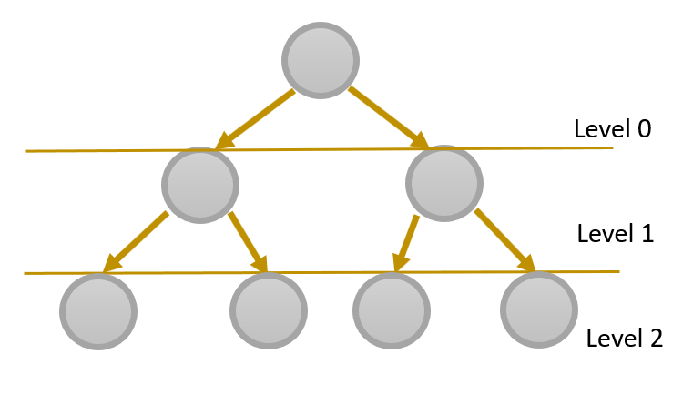
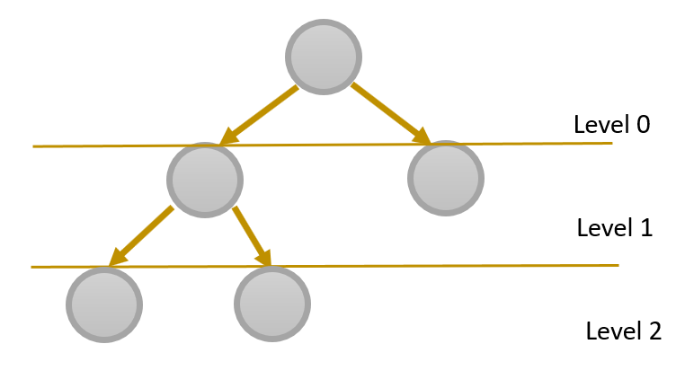
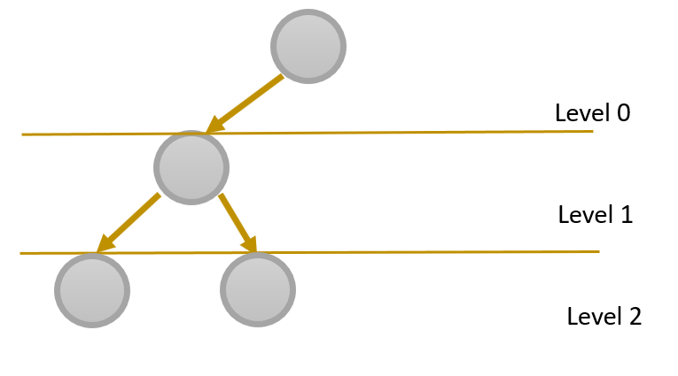
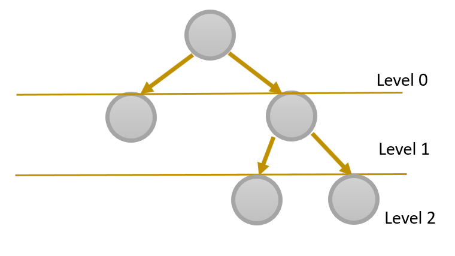

# BINARY HEAPS

## Types
  1. Min Heap
  2. Max Heap

## Properties
 1. A parent node must have at most two children
 2. It must be a complete tree. It must be filled from left to right, and every
    level must be full, with the exception of thr last level NOT needing to be full.
                   
    ### A Complete Tree  
    all levels are full
  
  
  
    ### A Complete Tree 
     first two levels are full, last level not full but filled from left to right)

               
 

    ### An Incomplete Tree 
     level 1 is not full before moving to level 2
               
  
  
  
    ### An incomplete Tree 
    Level 2 is filled from the right instead of left
               
  
   
   
 3. Min-heap: Every parent's key (node value) must be smaller than its children
   nodes'. This ensures the parent key is the smallest within the heap.
   Max-heap: Every parent's key (node value) must be larger than its children 
   nodes'. This ensures the parent key is the largest within the heap.

## Representing A Heap in an Array
  To do this we use the following formulae:
  
  - Calculate parent Index: Floor of (current index - 1)/ 2
   
  - Calculate left-child Index: 2 * parentIndex + 1
   
  - Calculate Right-child Index: 2 * parentIndex + 2
